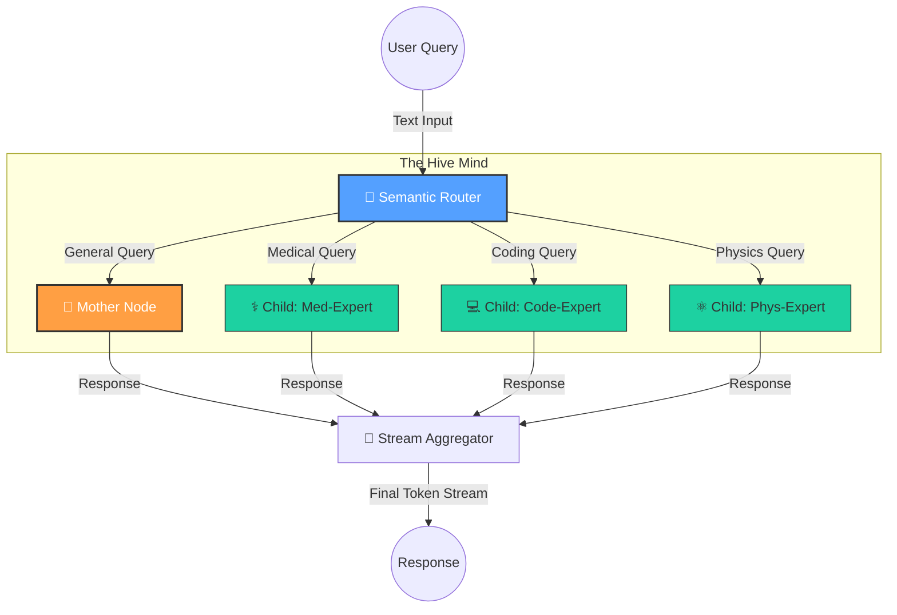
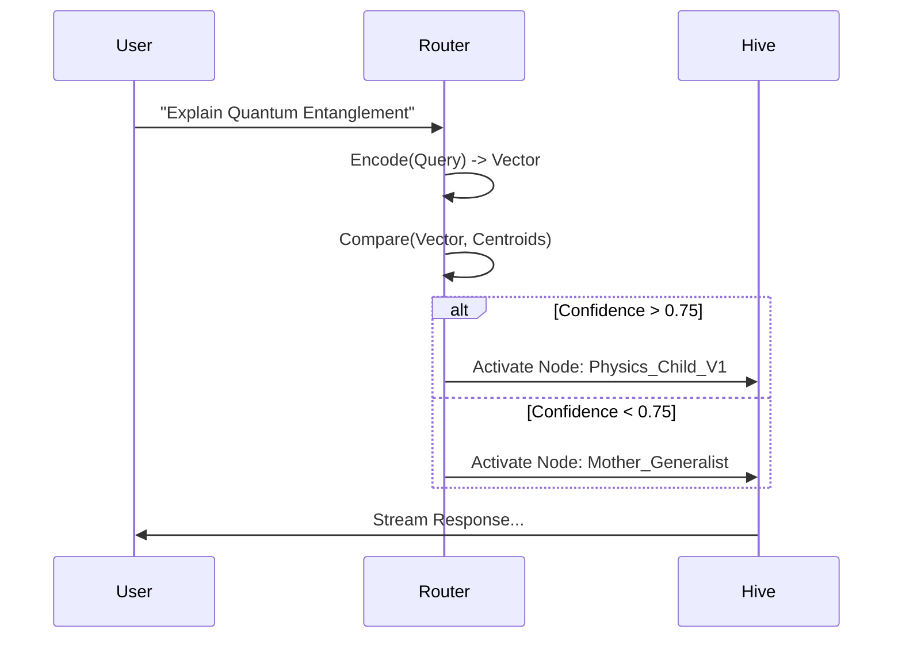
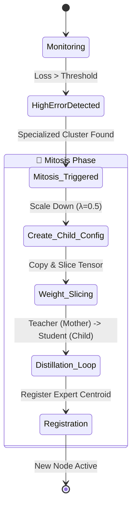

<div align="center">

# 🧠 K A R A M . v 1
### The Fractal-Dendritic Network (FDN)
*A Self-Replicating, Biological AI Architecture*

[](https://opensource.org/licenses/MIT)
[](https://www.python.org/)
[](https://pytorch.org/)
[](https://status.fynq.ai)

[Architecture](#-architecture) • [Workflow](#-workflow) • [Mitosis](#-the-mitosis-engine) • [Installation](#-quick-start)

---

> **"A neural network that doesn't just learn. It grows."**
> 
> KaramLLM is not a static model. It is a **Fractal Swarm**. It begins as a single "Mother" node and organically spawns specialized "Child" nodes when it encounters complex data, creating a hierarchical tree of intelligence that scales infinitely without linear compute costs.

</div>

---

## 🌌 High-Level Architecture

The system operates like a biological organism. A central **Brain (Mother)** handles general reasoning, while peripheral **Ganglia (Children)** handle specialized reflexes.



---

## 🧬 Low-Level Architecture: The Anatomy

The core of KaramLLM is the **Fractal Block**. Unlike standard Transformers, these blocks support **Weight Slicing**, allowing a 4096-dim parent to "graft" its weights onto a 2048-dim child instantly.

### Component Breakdown

| Component | Biological Analogy | Function |
| :--- | :--- | :--- |
| **Fractal Transformer** | *The Stem Cell* | A variable-size transformer that can be resized on the fly. |
| **Weight Slicer** | *DNA Transcription* | Mathematically slices tensors to inherit knowledge. |
| **Semantic Router** | *The Hippocampus* | Directs memories/queries to the correct region. |
| **Supervisor** | *Evolutionary Pressure* | Monitors loss. If high, triggers reproduction. |
| **Registry** | *Nervous System* | Tracks the state and address of every node. |

---

## 🔄 Workflow: The Lifecycle of a Thought

### 1. Ingestion & Routing
Every query is first converted into a vector by the **Semantic Router**. It measures the cosine distance to known "Expert Centroids."



### 2. The Mitosis Event (Self-Replication)
When the Mother Node struggles (high loss) on a specific topic, it gives birth.



---

## 💥 The Mitosis Engine
*Dynamic expansion system based on Information Entropy.*

<div align="center">

| Parent (Mother) | Scaling Factor ($\lambda$) | Child (Expert) |
| :---: | :---: | :---: |
| **Dim:** 4096 | `x 0.5` | **Dim:** 2048 |
| **Heads:** 32 | `x 0.5` | **Heads:** 16 |
| **Layers:** 32 | `x 0.75` | **Layers:** 24 |
| **Role:** Teacher | `Distill` | **Role:** Student |

</div>

<details>
<summary><b>Click to see the Weight Slicing Math</b></summary>
<br>

To initialize a child $C$ from parent $P$, we slice the weight matrices:

$$ W_{child} = W_{parent}[0:d_{child}, 0:d_{child}] $$

This preserves the "most important" principal components of the learned representations, assuming the features are sorted by variance (which we encourage during pre-training).

</details>

---

## ⚡ Quick Start

### 1. Installation
Clone the biological repository.
```bash
git clone https://github.com/ashwinrenjith/karamLLM.git
cd karamLLM
pip install -r requirements.txt
```

### 2. Awakening
Ignite the Supervisor and run the API.
```bash
# Terminal 1: Start the Inference API
python -m src.runtime.inference_api

# Terminal 2: Start the Evolution Supervisor (Optional)
python -m src.training.supervisor
```

---

## 📂 Project Structure

```bash
karamLLM/
├── src/
│   ├── models/       # FractalTransformer & Configs
│   ├── router/       # Semantic Vector Compass
│   ├── registry/     # State Management (JSON/SQL)
│   ├── runtime/      # Model Swapper (VRAM Management)
│   ├── training/     # Distillation & Supervisor Loops
│   └── utils/        # Weight Slicer (The Knife)
├── docs/             # Architecture Specs
└── weights/          # The Synaptic Storage
```

---

<div align="center">

**Built with 💙 by fynq.AI**
<br>
*Simulating Intelligence, One Fractal at a Time.*

</div>
